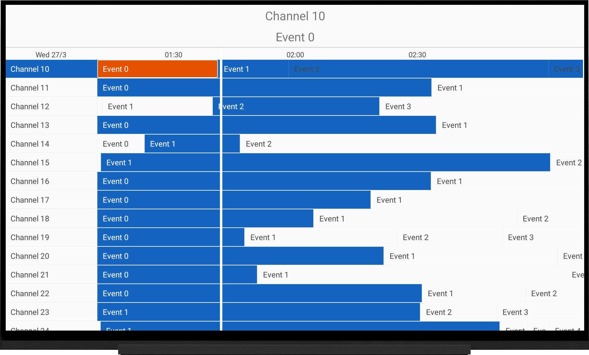

# TV Guide Viewer

A simplified tv guide viewer for Android TV heavily modified
from [android-tv-epg](https://github.com/korre/android-tv-epg)

It is available as Library and it can be used in any project easily.

## Demo Screenshot



## Demo Video


## Usage

Currently, the library is not available in any repository. You can clone the project and use it as a library module in your project.
Once imported as a module, you can use `GuideView` in your layout file.

```xml
    <dev.sajidali.guide.GuideView
        android:id="@+id/guide_view"
        android:layout_width="match_parent"
        android:layout_height="match_parent"
        android:clickable="true"
        android:focusable="true"
        app:gv_ChannelHeight="30dp"
        app:gv_ChannelWidth="150dp"
        app:gv_EventBackground="@drawable/gv_event_background"
        app:gv_EventTextColor="@color/event_text_color"
        app:gv_HoursToShow="2"
        app:gv_TimeLineColor="#fff"
        app:gv_TimeLineWidth="4dp" />
```

You can set the data to the `GuideView` using the following method:

```kotlin
private val provider = object : DataProvider {

    val events = HashMap<Int, List<Event>>()
    val channels = (0..300).map { position ->
        // Create a channel
    }

    override fun channelAt(position: Int): Channel {
        return channels[position]
    }

    override fun eventsOfChannel(position: Int): Collection<Event> {
        return events[position] ?: emptyList()
    }

    override fun eventOfChannelAt(channel: Int, position: Int): Event? {
        return events[channel]?.get(position)
    }

    override fun size(): Int {
        return 50 // Number of channels
    }

}
binding.guideView.apply {
    setDataProvider(provider)
    setEPGClickListener(object : GuideView.ClickListener {
        override fun onChannelClicked(position: Int, channel: Channel?) {
            // Handle channel click
        }

        override fun onEventSelected(channel: Channel?, program: Event?) {
            // Handle event selection
        }

        override fun onEventClicked(channelPosition: Int, programPosition: Int, channel: Channel?, program: Event?) {
            // Handle event click
        }

        override fun onEventLongClicked(channelPosition: Int, programPosition: Int, channel: Channel?, program: Event?) {
            // Handle event long click
        }

    })
}
```

## Customization

Table below lists the attributes that can be used to customize the `GuideView`.

| Attribute                 | Description                                                |
|---------------------------|------------------------------------------------------------|
| `gv_ChannelMargin`        | Channel Cell's margin                                      |
| `gv_ChannelPadding`       | Channel Cell's padding                                     |
| `gv_ChannelHeight`        | Channel Row's height                                       |
| `gv_ChannelWidth`         | Channel Column's Width                                     |
| `gv_ChannelBackground`    | Channel Row's Background. Can be a selector                |
| `gv_EventBackground`      | Event Cell's Background. Can be a selector                 |
| `gv_EventTextColor`       | Event Cell's Text Color. Can be a selector or single color |
| `gv_EventTextSize`        | Event Cell's Text Size                                     |
| `gv_TimebarHeight`        | Timebar Row's height                                       |
| `gv_TimebarTextSize`      | Timebar Text Size                                          |
| `gv_TimeLineWidth`        | Time Line's width                                          |
| `gv_TimeLineColor`        | Time Line's color                                          |
| `gv_HoursToShow`          | Number of hours to show in the guide                       |
| `gv_DaysBack`             | Number of days allowed before now                          |
| `gv_DaysForward`          | Number of days allowed after now                           |
| `gv_TimeSpacingInMinutes` | Spacing between times displayed in timebar i.e 30 minutes  |
| `gv_TimebarBackground`    | Timebar background color                                   |
